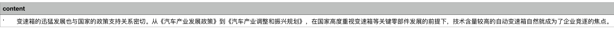
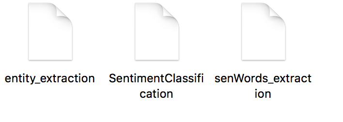
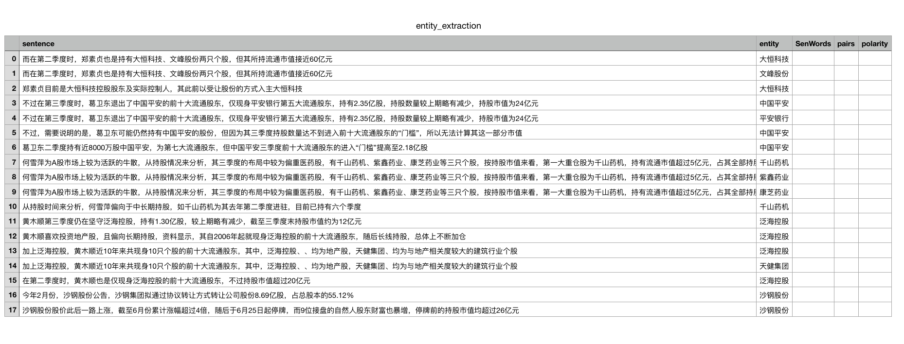
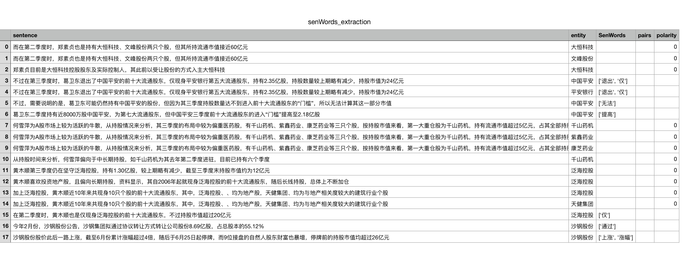
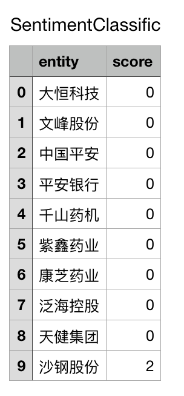

#基于情感词典的情感分类

###使用文档
--
程序运行前需做好如下准备：
1.本程序是用python3.6编写，首先确保有python3环境。
2.句法分析的工具是使用哈工大ltp工具包，使用前请先安装，使用pip安装:
<pre>
<code>$pip install pyltp</code>
</pre>
其分词用的模型已保存在文件夹下，文件名为*ltp_data_v3.4.0*
###程序配置
本实验采用挂载情感词典的方法，情感词典分为积极和消极，保存在*dictionary*文件夹下。

实体表保存在entity文件夹下的object文件。
###程序信息
程序存储在代码文件夹下，文件名为demo_temp
###输入文件格式
本方法用python编写，为便于操作的简单方便，参考前期提供的语料库格式，输入文档格式选用*.csv*格式，且需处理的文字内容为列名为*content*，样例如下：

样例文件在*alldata*文件夹中提供参考

###输入参数
程序运行时，需提供如下几个参数：

1. 输入文件路径
（该路径下存有待处理的文件，文件格式上节已给出。）
2. 输出路径
（该路径存储程序运行完的结果）

###输出结果
输出结果保存在输出路径下，名为*result*的文件名，文件夹下存储每篇文章的结果。

每篇文章的结果由三个文件组成，均为csv文件，分别是

####entity_extraction文件
该文件存放实体抽取结果,其结果样例如下：

表格由sentence，entity，SenWords，pairs，polarity组成。由于是实体抽取，故后三列为空。
####senWords——extraction文件
该文件存放情感词抽取结果，其结果样例如下：

未抽出情感词的句子，极性设为0，表示中性。
###SentimentClassification文件
该文件存放情感分类结果，其结果样例如下：

分数大于0的表示积极，小于0的表示消极，等于0表示中性。